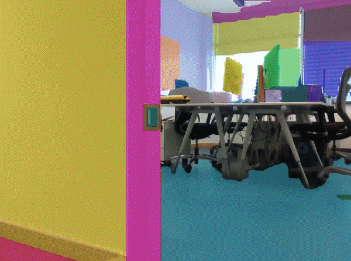
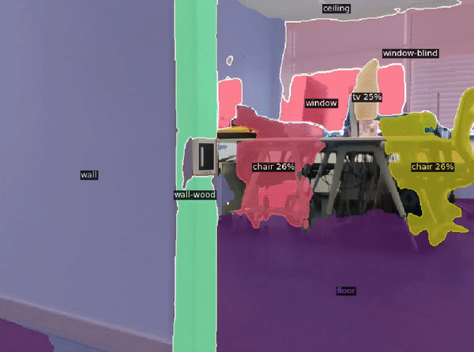

# Semantic Scene Segmenter

| Scene Segmentation (**Fast-SAM**)        | Semantic Scene Segmentation (**pFCN**)             |
| ---------------------------------------- | -------------------------------------------------- |
|  |  |

## 🧠 Overview

**Semantic Scene Segmenter** is a modular framework for real-time scene segmentation using configurable, state-of-the-art models. It supports semantic understanding of visual data for robotics and perception systems.
This tool is primarily designed to integrate with the [vS-Graphs](https://github.com/snt-arg/visual_sgraphs) pipeline, where frames captured from a robot's camera are forwarded to this module for scene segmentation.

The framework currently covers two main modules, including **[FastSAM](https://github.com/CASIA-IVA-Lab/FastSAM)** for real-time scene segmentation and **[PanopticFCN](https://github.com/dvlab-research/PanopticFCN)** for real-time scene segmentation and semantic object detection.

### 📊 Benchmarking

Benchmark results for this framework using various segmentation libraries can be found [here](https://github.com/snt-arg/scene_segmentation_benchmark). The repository includes performance comparisons across speed, accuracy, and resource usage.

### Supported Models

- ✅ **YOSO** (**[link](https://github.com/hujiecpp/YOSO)**) – Lightweight, real-time panoptic segmentation model optimized for speed and efficiency.
- ✅ **PanopticFCN** (**[link](https://github.com/dvlab-research/PanopticFCN)**) – A unified framework for panoptic segmentation, combining both semantic ("stuff") and instance ("things") recognition in real time.

## 📚 Preparation

### I. Clone the Repository

Create a new **ROS2** workspace and clone this repository into the `src` folder of your workspace:

```bash
git clone --recurse-submodules git@github.com:snt-arg/scene_segment_ros.git
# Or `git clone -b ros2-jazzy ...` for a particular branch
```

### II. Install Python Dependencies

Install the required Python libraries using:

```bash
pip install -r src/requirements.txt
```

### III. Download & Configure Models

Download one of the model checkpoints from the official repositories:

- [YOSO Checkpoints](https://github.com/hujiecpp/YOSO/?tab=readme-ov-file#model-zoo)
- [PanopticFCN Checkpoints](https://github.com/dvlab-research/PanopticFCN#results)

Place the downloaded `.pth` model file into the `/include` directory of this repository. Then, update the path to the model in the corresponding [configuration file](/config/) under `config/cfg_[model].yaml`.

> 🛎️ Note: We recommend placing models in the `/include` folder to streamline integration across frameworks. The system uses the absolute path of this directory to load model weights.

### IV. Install Model Frameworks

Depending on the model you intend to use, install the following additional dependencies:

```bash
git clone https://github.com/facebookresearch/detectron2.git
python -m pip install -e detectron2
```

## 🚀 Launch the Code

You can run the below launch files (accessible from `/launch` folder):

- **YOSO**: `ros2 launch segmenter_ros segmenter_yoso.launch`
- **PanopticFCN**: `ros2 launch segmenter_ros segmenter_pFCN.launch`

## 🔨 Configurations

The system has different configurations for each of the segmentation libraries, accessible from [`config`](/config/) folder. In the table below, you can see these configurations in details.

| Main Category  | Parameter               | Default        | Description                           |
| -------------- | ----------------------- | -------------- | ------------------------------------- |
| `image_params` | `image_params`          | 640            | width of the input image              |
| `ros_topics`   | `raw_image_topic`       | `/img`         | raw image topic                       |
|                | `segmented_image_topic` | -              | segmented image topic (custom Msg)    |
|                | `segmented_image_vis`   | -              | segmented image topic (visualization) |
| `model_params` | `model_name`            | -              | name of the model                     |
|                | `model_path`            | -              | path of the model file                |
|                | `model_config`          | -              | path of the model's specific configs  |
|                | `point_prompt`          | [[0, 0]]       | a point for segmentation              |
|                | `box_prompt`            | [[0, 0, 0, 0]] | boxes for segmentation                |
|                | `text_prompt`           | -              | text prompt (e.g., "a dog")           |
|                | `point_label`           | [0]            | 0: background, 1: foreground          |
|                | `iou`                   | 0.9            | annots filtering threshold            |
|                | `conf`                  | 0.4            | object confidence threshold           |
|                | `contour`               | False          | draw contours                         |

### 💡 Results Filtration

In order get only the classes that you want (such as `wall` or `floor`), you need to know the identifier of the class in **Detectron2** ([link](https://github.com/facebookresearch/detectron2/blob/main/detectron2/data/datasets/builtin_meta.py)) and set the `output/classes` in the [configuration file](/config). For a complete list of class labels for the `COCO` panoptic dataset, you can use [this documentation](include/coco_panoptic_labels.md).

## 🤖 ROS Topics and Parameters

### 📥 Subscribed Topics

| Topic                       | Type                           | Description                                       |
| --------------------------- | ------------------------------ | ------------------------------------------------- |
| `/vs_graphs/keyframe_image` | `segmenter_ros/VSGraphDataMsg` | KeyFrames to be segmented                         |
| ├── `key_frame_id`          | `UInt64`                       | ID of the KeyFrame being processed in `vS-Graphs` |
| └── `key_frame_image`       | `sensor_msgs::Image`           | Image data of the KeyFrame to be segmented        |

### 📤 Published Topics

| Topic                             | Type                              | Description                                |
| --------------------------------- | --------------------------------- | ------------------------------------------ |
| `/camera/color/image_segment`     | `segmenter_ros::SegmenterDataMsg` | Semantic segmentation results              |
| ├── `key_frame_id`                | `UInt64`                          | ID of the processed KeyFrame               |
| ├── `segmented_image`             | `sensor_msgs::Image`              | The output segmented image                 |
| ├── `segmented_image_uncertainty` | `sensor_msgs::Image`              | Pixel-wise uncertainty of the segmentation |
| └── `segmented_image_probability` | `sensor_msgs::PointCloud2`        | Per-pixel class probability distribution.  |
| `/camera/color/image_segment_vis` | `segmenter_ros::VSGraphDataMsg`   | Visualized semantic segmentation frame     |
